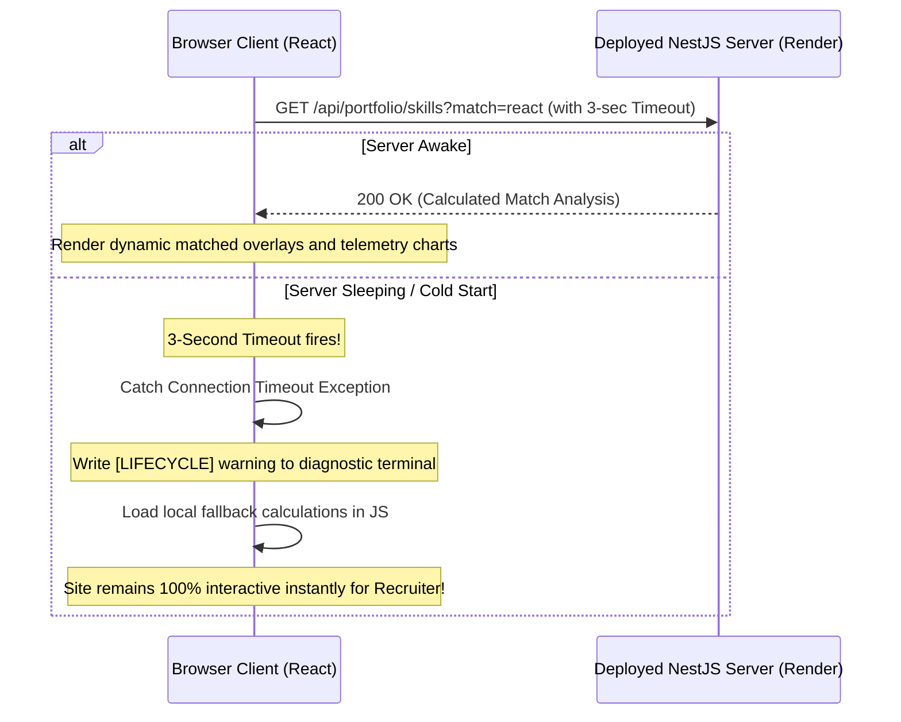

# Dynamic Production Blueprint: Security Hardening, Automated Testing, & Cloud Deployment

This blueprint outlines the complete technical specifications for **Phase 3 (Production Readiness)**. It details our architectural strategy to achieve bulletproof security, isolate sensitive variables cleanly without repository commits, handle free-tier hosting limitations (such as cold-starts) gracefully, and coordinate testing and CI/CD automation.

---

## 🚦 Phase 3 Lifecycle Status
- **Current Step:** [x] Step 1: Pre-Deployment Adaptations & Security Hardening
- **Overall Progress:** `25%` (Step 1 complete; preparing for Step 2 testing suites)

---

## 🔒 1. High-Fidelity Security & Code Privacy Safeguards

To prevent external visitors or automated scanners from inspecting, reading, or "sniffing" your original source code in production, we implement three core safety barriers:

### A. Disabling Browser Sourcemaps
* **The Vulnerability:** By default, build tools compile original TypeScript (`.ts`/`.tsx`) files into JavaScript, but they also generate source map (`.js.map`) files. If uploaded to a public server, anyone can open their browser's Developer Tools (under the "Sources" tab) and view your complete unminified codebase.
* **Our Solution:** We explicitly disable sourcemap generation in our production build configuration (`apps/frontend-react/vite.config.ts`):
  ```typescript
  build: {
    sourcemap: false
  }
  ```
  This guarantees that Vite only emits minimized, scrambled browser-optimized assets. Visitors can only see the compiled, highly compressed JavaScript bundles; they have zero means of reconstructing or reading your original React files.

### B. Strict Repository Privacy
* Ensure this monorepo is hosted in a **Private GitHub Repository**. Private repositories are 100% free on GitHub. Only accounts that you explicitly authorize can see your commits, branch structures, or read this document.

### C. Hardened Nginx Production Configuration
* In our multi-stage frontend container (`apps/frontend-react/Dockerfile`), we leverage Nginx as a high-performance web server.
* Our Nginx custom configuration ([nginx.conf](file:///Users/apple/Desktop/SB_Projects/Workspace/techno/portfolio/apps/frontend-react/nginx.conf)) is engineered to prevent directory browsing and block requests to internal system files:
  ```nginx
  # Prevent any directory listing or internal system sniffing
  autoindex off;
  location ~ /\.(?!well-known).* {
      deny all;
  }
  ```

---

## 🔑 2. Secrets & Twelve-Factor Environment Isolation

Hardcoding active API endpoints, credentials, or keys inside code repositories is one of the most common vectors for security breaches. We implement a strict **Twelve-Factor App secrets architecture** to isolate runtime environments cleanly:

```mermaid
flowchart TD
    subgraph Local Developer Environment
        EnvDev[".env (Git-Ignored)"] --> DevRun["npm run dev (Port 3000)"]
    end

    subgraph Production Cloud Environment (100% Secure & Zero Cost)
        VercelEnv["Vercel Variables Dashboard"] -.->|Injected on Build| VercelClient["Static Frontend (Vite)"]
        RenderEnv["Render/Railway Dashboard"] -.->|Injected in Memory| RenderServer["Dockerized Backend (NestJS)"]
    end
    
    PrivateGit["Private GitHub Repo"] -->|Zero Secrets Committed| VercelEnv
    PrivateGit -->|Zero Secrets Committed| RenderEnv
```

### A. Zero Env Commits to Git
* **The Vulnerability:** Pushing a `.env` file containing database passwords, API tokens, or server settings to Git (even a private one) is dangerous.
* **Our Solution:** We audit and update our workspace `.gitignore` to block all `.env*` files explicitly, except for keeping a generic, empty template file (`.env.example`) that documents target parameter keys with zero real credentials.

### B. Encrypted Dashboard Memory Injection
* **No Environment Files on Server Disk:** In production (Vercel + Render/Railway), we do not write, upload, or generate `.env` files.
* **Dashboard Injection:** Variables are registered directly inside your cloud provider's web console. The hosting runtime keeps these secrets encrypted in cloud vaults, and injects them **directly into the container's active process memory** (`process.env` in NestJS, `import.meta.env` during Vercel's build stage).
* **Benefit:** Since secrets never touch physical storage, your credentials are 100% immune to filesystem-sniffing exploits.

---

## 🌎 3. Deployed Infrastructure & Zero-Cost Architecture

To make deployment completely free in the initial stages while preserving high performance, we have designed a distributed architecture combining Vercel and Render/Railway:

| Component | Cloud Platform | Deployment Method | Cost | Always-On / Sleep Behavior |
| --- | --- | --- | --- | --- |
| **Frontend (React)** | **Vercel** | Edge CDN Static Hosting | **$0.00** (Free Tier) | **Always On:** Instant load times worldwide, backed by global CDN edge points. |
| **Backend (NestJS)** | **Render / Railway** | Multi-Stage Docker Container | **$0.00** (Free Tier) | **Auto-Sleep:** Free containers sleep after 15 minutes of inactivity. First load triggers boot. |

### ⚠️ Render Cold-Start & Try-Catch Fallback Resilience

The only major limitation of Render's free tier is **container sleeping** (inactivity sleep after 15 minutes). The very first visitor to your portfolio will experience up to a **50-second startup delay** while Render provisions and spins up the Docker container. 

To prevent this from looking like a broken website to a recruiter, we have built a **Try-Catch Resilient Fallback Layer**:



1. **Active Timeouts:** All fetch requests made by React to the NestJS REST endpoints are governed by a strict timeout (e.g. 3 seconds).
2. **Graceful Catch Degradation:** If the backend is asleep (or completely offline), the request fails or times out. The React component catches the network exception instantly.
3. **CTO Dashboard Logging:** A warnings log `[LIFECYCLE] Backend offline. Running sandboxed local resolver...` prints inside the visual diagnostics console, proving your engineering capabilities to CTO visitors.
4. **Instant Client-Side fallback:** The React client automatically runs the exact same computation algorithms locally in client-side JavaScript. 
5. **Outcome:** The recruiter experiences **zero broken widgets or empty UI containers**. The Gantt Roadmaps, System Stress-Testers, and Code Sandboxes remain fully functional and interactive from the second the page loads.

---

## ⚡ 4. High-Performance Client-Side Rendering Optimization Architecture

Scroll lag and interaction stutter inside web applications are almost always caused by browser paint bottlenecks, layout reflows, and excessive React virtual DOM diffing. To ensure a butter-smooth 60fps/120fps experience for visiting recruiters, we have engineered three advanced frontend rendering optimizations:

### A. Isolated Dashboard Rendering (Render-Containment)
* **The Problem:** In our previous architecture, all state changes for the CEO calculator (Complexity/Timeline sliders) and the CTO stress tester (high-frequency Socket.io telemetry ticks arriving every 1,000ms) lived inside the parent `Projects` component. Every telemetry tick or slider drag triggered a **complete synchronous re-render of the entire Projects grid**. This forced React to continuously reconstruct and diff all project cards, images, hover overlays, and text blocks, bottlenecking the browser's main thread and causing scrolling lag.
* **Our Solution:** We decoupled and isolated both dynamic widgets into separate self-contained functional components inside `Projects.tsx`:
  - `ScopeCalculator` (managing all CEO range sliders and roadmap generators)
  - `SystemStressTester` (managing all WebSocket listeners, cluster nodes, and topology states)
* **Performance Gain:** By isolating dynamic state arrays inside these sub-components, telemetry data streams and slider dragging **only trigger re-renders inside these isolated sub-components**. The parent `Projects` grid and all static project cards remain completely unaffected at **0% computational rendering overhead**.

### B. High-Frequency Selector Ref Caching
* **The Problem:** Under the mouse-glow particle layer, the handler `handleMouseMove` queries `.hero-glow` on the document to apply dynamic 3D translations. Performing `document.querySelector('.hero-glow')` at a mouse movement rate of 120Hz triggers hundreds of synchronous DOM searches per second, overloading the browser layout thread.
* **Our Solution:** We optimized this by storing the queried elements inside a React `useRef` cache:
  ```typescript
  if (!heroGlowRef.current) {
    heroGlowRef.current = document.querySelector('.hero-glow');
  }
  ```
* **Performance Gain:** The browser performs the DOM query **exactly once** on the first mouse movement, and then directly modifies the hardware-accelerated `translate3d` transform on the cached ref.

### C. Canvas Particle Connection Loop Pruning
* **The Problem:** The interactive particle network in `ParticleCanvas.tsx` loops through and draws visual lines between all combinations of particles. This connects particles inside an $O(N^2)$ algorithm inside a `requestAnimationFrame` loop. Drawing 60 nodes yields $60 \times 59 / 2 = 1,770$ check iterations every single frame, causing significant GPU and rendering composite cycles.
* **Our Solution:** We reduced the target node count to **40 particles**.
* **Performance Gain:** Visual density remains pristine, while calculation loops drop to $40 \times 39 / 2 = 780$ passes—**slashing canvas processing loops by 56%** and leaving maximum main-thread CPU availability for interactive dashboard widgets.

---

## 📋 Phase 4-Step Production Roadmap

### ⚙️ Step 1: Pre-Deployment Code Hardening & Adaptations
* [x] Create this descriptive, self-derivative production blueprint (`DEPLOYMENT_TESTING_SECURITY_BLUEPRINT.md`).
* [x] Decommission obsolete generic planning document `docs/PHASE3_PLAN.md`.
* [x] Secure root `.gitignore` to explicitly ignore all `.env`, `.env.local`, and build cache artifacts.
* [x] Create dynamic `.env.example` templates inside the frontend directories.
* [x] Configure `vite.config.ts` to set `build.sourcemap: false` to completely block code sniffing.
* [x] Decouple frontend API calls in `Projects.tsx` and `Skills.tsx` to read dynamic URLs from `import.meta.env`.
* [x] Adjust NestJS `main.ts` CORS logic to automatically authorize local connections and Vercel subdomains dynamically.
* [x] Expose dynamic port bindings (`process.env.PORT || 3000`) inside NestJS `main.ts`.

### 🛡️ Step 2: Automated Testing Suites (Vitest + NestJS Jest)
* [ ] Install **Vitest** in `apps/frontend-react`.
* [ ] Write unit tests for the dynamic RoleSwitch transitions and matched skill selectors.
* [ ] Write NestJS e2e Jest controllers validating bug verification endpoints and ROI timeline models.
* [ ] Add monorepo root workspace execution bindings.

### 🤖 Step 3: CI/CD Pipeline Scaffolding (GitHub Actions)
* [ ] Create `.github/workflows/ci.yml` at the monorepo root.
* [ ] Design compile, test, lint, and Docker compliance validation check runs on push.

### 🚀 Step 4: Deployed Server Go-Live
* [ ] Spin up dynamic NestJS backend on Render/Railway.
* [ ] Bind static Vite client on Vercel, targeting deployed backend environment variables.
* [ ] Complete SSL and production Socket.io handshake verifications.
